# 邢洲 · zhouzxing

> 邢洲 — Linux kernel · Distributed systems & Parallel programming · AI research
>
> 👋 Hi, I'm xingzhou。全栈研发出身，从操作系统内核到 AI Agent 平台，持续在系统底层与智能层之间打通。

<!-- BEGIN snake -->

<!-- END snake -->

---

## 🤖 AI & 大模型 · 当前主方向

从 LLM 到 Agent 平台，把模型能力真正落到系统层与工程实践里。

| 方向 | 具体内容 |
|---|---|
| **大模型应用** | LLM 应用架构、RAG、多轮对话状态管理、长上下文工程 |
| **Agent 开发** | 多 Agent 编排、MCP 工具协议、Agent Sandbox、自主决策与工具调用 |
| **训练与推理** | PyTorch、CUDA kernel、GPU 算力调度、模型编译与量化 |
| **端侧 AI** | 小模型下沉车规芯片、端侧推理框架、MiniMind 入门研究 |
| **多模态** | 虚拟数字人、CSM 音视频处理、ASR / TTS、图像识别与标注 |
| **模型研发** | 系统研发与优化、ML/CV/NLP 综述、minimind 入门与训练实践 |
| **情报工程** | 自建 AI 情报聚合器，38 源 / 88 模型 / 29 Agent 平台全景监测 |

### 核心认知

**AI 是新的操作系统。** 模型能力越强，对下层调度的压力越大 —— AI 训练负载对内核调度、内存、文件系统的冲击，是新的性能瓶颈来源。

**Agent 是下一个交互范式。** 关键不在于模型有多强，而在于能否把 LLM 的工具调用能力做成稳定、可控、可观测的系统抽象。

**模型只是入口。** 真正拉开差距的是模型之上的平台层 —— 我维护了 29 个 Agent 平台 / 88 个模型的对比注册表，持续追踪这条技术演进线。

---

## 🧠 系统软件 · 专业纵深

十余年系统软件积累，从内核一路做到应用层协议栈。

| 方向 | 具体内容 |
|---|---|
| **OS 内核** | Linux 内核、uCore / rCore、操作系统设计与实现（李治军 / 南大）、kernel 参数生效机制、Wine 设计与实现 |
| **浏览器内核** | 浏览器内核开发、浏览器设计与实现、浏览器插件设计与实现、Markdown 渲染工具 |
| **体系结构** | 计算机体系结构演进、CPU 体系结构综述、CXL、存储芯片发展脉络、CUDA |
| **虚拟化与安全** | 虚拟化核心技术、Docker 虚拟化实现、沙箱安全、病毒检测与防护 |
| **网络协议栈** | 图解 TCP/IP、HTTP 权威解析、HTTP/2 Multiplexing、HTTP/3-QUIC、WebSocket、BGP-QUIC、NAT、VLAN |
| **外设与驱动** | Linux 驱动开发详解、蓝牙配对协议开发、磁盘管理、电源管理、OTA 嵌入式 |
| **编译与链接** | 编译原理、GCC 编译器设计与实现、glibc 解读、链接器设计与实现、链接加载、调试器设计与实现 |
| **网络虚拟化** | RDMA、DPDK、智能网卡 Smart NIC、弹性网卡、P2P 项目研究 |

---

## ⚙️ 分布式系统 · 工程落地

从消息队列到云原生，覆盖分布式系统的每一层。

| 方向 | 具体内容 |
|---|---|
| **消息队列** | Kafka 实战、RocketMQ 实战、RabbitMQ 设计与实现、SofaMQ 实践、Pulsar 实践、ActiveMQ 实践、MQ 选型综述 |
| **服务治理** | SpringCloud 设计与实现、SpringCloudAlibaba 实践、微服务拆分规范、注册中心 / 网关 / 配置 / 链路追踪组件演化、高可用方案 |
| **RPC 与序列化** | RPC 框架综述、序列化协议性能分析、Dubbo 详解 |
| **云原生** | Docker 实践与原理、Podman / flatpak 比较、Kubernetes 核心技术、云原生框架、边缘计算核心技术 |
| **分布式基础** | 分布式事务解决方案、分布式锁设计方案、分布式共享内存、一致性 Hash、BIO / NIO / AIO |
| **数据库** | MySQL / Oracle / PostgreSQL、OceanBase 实践、分布式数据库综述、存储引擎设计与实现、InnoDB 多核性能优化、SQL 优化、MongoDB、H2 |
| **存储** | RAID 硬件存储与备份、NAS、对象存储技术选型、Git 设计与实现、文本 / PDF 处理工具 |
| **架构案例** | 阿里亿级长连网关演进、12306 秒杀系统、Wikipedia 架构、百万规模用户网站演化、开源云存储方案 |

---

## ⚡ 算法与性能优化

| 方向 | 具体内容 |
|---|---|
| **数据结构** | 数据结构与算法分析、一致性 Hash、并查集、压缩算法、索引数据结构对比 |
| **性能优化** | 并发编程优化、非阻塞算法、服务器高负载应对策略、可伸缩性算法、排行榜数据结构设计、10G URL 黑名单快速判定、二进制逆向分析 |
| **大数据** | 大数据综述、数据一致性选型、数据仓库核心技术 |
| **多媒体** | 音视频处理工具、图像识别标注、图形技术研究 |

---

## 📚 元堡 · 博客知识图谱

元堡博客 · **415 篇原创技术文章**，按 8 大领域组织，覆盖从硬件到应用的全栈纵深。

展开全部分类目录（点击展开）

### 🖥️ 系统软件与协议 · 189 篇
> 占比 46% —— 最深的一根技术树。
>
> 计算机网络技术栈（自顶向下）· TCP/IP 图解 · HTTP 权威解析 · HTTP/2 · HTTP/3-QUIC · WebSocket · SSO · BGP-QUIC · NAT · VLAN · 浏览器内核设计与实现 · Socket 套接字设计与实现 · 网络编程 · 操作系统设计与实现（李治军 / 南大）· uCore-rCore 深入研究 · Linux 驱动开发详解 · 外设与驱动管理 · 内存管理综述 · 进程调度器设计与实现 · 协程特性与实现 · JVM 深入研究（堆内存 / 对象生命周期 / GC 策略 / JMM）· OpenJDK 深入研究 · 汇编语言编程实践 · GCC 编译器设计与实现 · glibc 解读 · 编译连接加载 · CPython 设计与实现 · Go in action · Rust · Bash / Shell 设计与实现 · IO 技术体系 · 设计模式 · csapp · APUE

### 💻 编程语言与实现 · 34 篇
> 语言综述 · Java SE 基础实践（17 / 21-24 新特性）· Effective Java · Kotlin / Scala · C++ STL · C++ 编译器特性 · C 性能优化 · 图解 GCC · Python 框架选型 · 高性能 Python · FastAPI · Rust · 编译原理 · 汇编语言 · 编程范式 · 线程池 / 虚拟线程 / 异步编程 · 并发核心技术栈

### 🧮 算法与数据处理 · 52 篇
> 人工智能综述 · 大模型应用实践 · ML / CV / NLP 综述 · Agent 开发实践 · 聊天机器人研究 · 虚拟数字人 · minimind 入门研究 · 数据库系统理论与实践 · 存储引擎设计与实现 · 索引数据结构对比 · InnoDB 多核性能优化深度指南 · 分布式数据库综述 · OceanBase 实践 · 分布式 / 一致性选型 · 对象存储选型 · 大数据综述 · 数据仓库核心技术 · Geo 数据类型 · 正则表达式设计与实现 · 数据结构综述 · 算法综述

### 🔗 中间件与交互感知 · 17 篇
> Kafka 实战 · RocketMQ 实战 · RabbitMQ 设计与实现 · SofaMQ 实践 · Pulsar 实践 · ActiveMQ 实践 · MQ 选型综述 · 分布式网关 · Linkerd Service Mesh · ZooKeeper 分布式协调 · Redis 实践 · Lua 脚本设计与实现 · ES 检索核心 · 图解密码技术 · 压缩算法实践 · 集群管理工具 · RAID 硬件存储与备份

### 🏭 产业与垂直应用开发 · 101 篇
> 浏览器内核开发 · 浏览器插件设计与实现 · 浏览器设计与实现 · Markdown 渲染工具研究 · Electron 研究 · 前端框架与前端技术栈综述 · UI 设计与实现 · cli 客户端开发 · 网络下载器设计与开发 · 远程桌面核心技术 · 通讯社交工具 · 安全机制（代码审计 / 数据脱敏 / 服务端监控预警平台 / 认证授权 / GSS）· DNS 服务器开发 · SSL 协议 · LDAP · Mail 服务 · 性能优化（可伸缩性算法 / 并发编程优化 / 非阻塞算法 / 高负载应对策略）· 业界案例（阿里亿级长连网关 / 12306 秒杀 / Wikipedia 架构 / 百万用户网站演化 / 开源云存储）· 架构设计（低代码平台 / 定时任务选型 / 日志系统优化 / DDD）· RPC 框架 · 序列化协议性能分析 · Spring 生态（Boot / Security / MVC）· SpringCloud / SpringCloudAlibaba · 微服务技术债 / 拆分规范 / 治理平台 · Netty 最佳实践 · C++ / Python 企业框架开发 · Tomcat 设计与实现 · Nginx · 文本处理（字体仓库 / 排版工具 / 文档处理 / PDF 工具库 / 流程图 / Office 全家桶 / Vim）· Git 最佳实践 · 版本跟踪系统设计与实现

### ⚡ 性能优化 · 7 篇
> 排行榜数据结构设计 · 10G URL 黑名单快速判定 · 二进制逆向分析 · OA 算法题 · Huawei 2018 笔记本性能分析 · 笔试科目

### 🏗️ 基础设备与理论 · 11 篇
> 计算机体系结构演进 · CPU 体系结构综述 · 计算机组成原理 · 计算机核心技术综述 · 计算机多媒体技术 · CUDA 研究 · CXL 详解 · 存储芯片发展脉络 · 研究方向预演 · 数码产品研究 · 游戏体验与研究

### 🚀 落地项目 · 25 篇
> 物联网（设备类 / 穿戴类 / 门禁系统 / Esp32 系统设计）· 电商类 · 社交类（搭友出行系统）· 舆情预警 · 金融体系 · 银行业务系统 · 视频直播类 · AI 应用（后台脚手架框架 / 教培系统架构 / 智能穿戴设备 / 0-1 系列 / AI 培训）· 代发薪系统 · 实时天气预警系统 · 飞行器系统 · RuoYi 架构设计借鉴

---

## 🛠️ Projects · 核心参与

| 项目 | 内容 |
|---|---|
| **AI 情报聚合器** | 38 个数据源 · 88 个模型 · 29 个 Agent 平台全景监测，自建 5W1H 正文提取与摘要生成 |
| **内核研究** | OS kernel、Linux 驱动开发详解、Linux 虚拟存储空间研究、NIC 子系统详解 |
| **浏览器** | 浏览器内核开发、浏览器设计与实现、浏览器插件设计与实现 |
| **AI** | PyTorch · CUDA · LLM · Agent 开发实践 · minimind 入门研究 · 虚拟数字人 · CSM 音视频处理 |
| **Web** | C/S 服务端、P2P 项目研究、Web-Server 设计与开发 |
| **落地** | IoT · Esp32 门禁 · 教培系统架构 · 实时天气预警 · 代发薪系统 |

---

## 💻 语言栈

| | 精通 | 熟练 | 了解 |
|---|---|---|---|
| **系统** | C · C++ · 汇编 | Rust | — |
| **服务端** | Java · Go | Python | Scala · Kotlin · C# · D |
| **脚本** | Bash · Shell | Lua | PHP |

**全栈研发** · 浏览器内核 · 操作系统内核 · AI 工程

---

## ✉️ Contact

- **Email** — geek.0801.tech@gmail.com
- **Blog** — 元堡
- **Resume** — [PDF](https://github.com/zhouzxing/resume/blob/master/xingzhou_dev_17675616902.pdf)
- **GitHub** — [zhouzxing](https://github.com/zhouzxing)

---

README 动画由 [snake_game_gen.py](https://github.com/zhouzxing/zhouzxing/blob/main/snake_game_gen.py) 生成 · 提交记录由 [snake_game_fetch.py](https://github.com/zhouzxing/zhouzxing/blob/main/snake_game_fetch.py) 聚合 · 贪吃蛇吃掉的每个圆点对应一次真实 commit（按仓库着色）

[snake_gen.py](https://github.com/zhouzxing/zhouzxing/blob/main/snake_gen.py) / [snake_activity_fetch.py](https://github.com/zhouzxing/zhouzxing/blob/main/snake_activity_fetch.py) 保留为原始贡献图版本（snake.svg 仍在仓库中，可随时切回）
